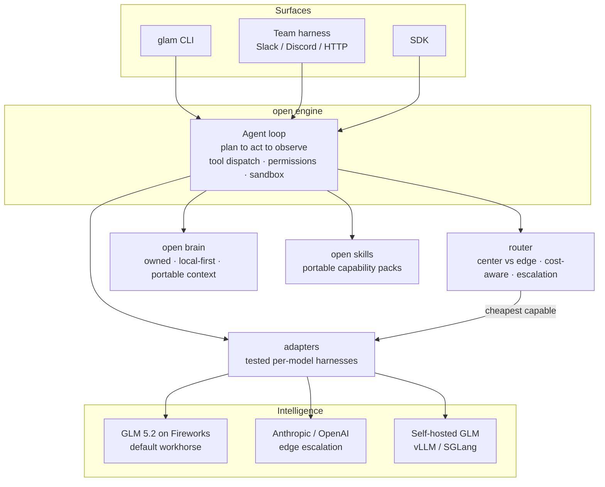

# Architecture

The canonical, GitHub-rendered view of glamfire. The full contract for each box is in
[`../SPEC.md`](../SPEC.md) §5. Source diagram: [`../marketing/assets/architecture.mmd`](../marketing/assets/architecture.mmd).

## Reading the diagram

- **Surfaces** are thin; all real work goes through the **engine**.
- The **engine** owns the agent loop and enforces permissions/sandboxing — the model
  never bypasses the gate.
- The **router** is the buyer's side of the commodity intelligence market: it picks
  the cheapest capable model per task (GLM 5.2/Fireworks by default) and escalates to
  frontier only on low confidence — the frontier earns its tokens.
- The **brain** is yours: local-first, portable, exportable. It is never uploaded,
  never rented back — the ground glamfire holds in the context wars.
- **adapters** turn each model into a working agent behind one conformance-tested
  contract — switching models is config, not a rewrite.
